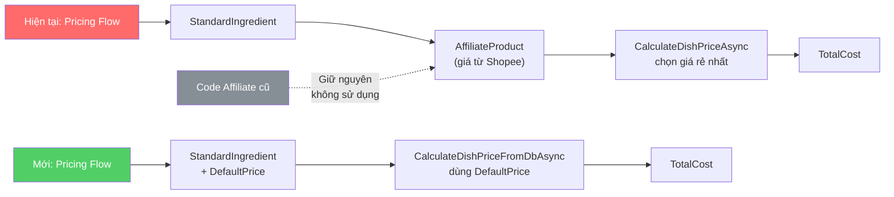

# 📋 Kế Hoạch Chuyển Đổi Pricing: Affiliate → Giá Cứng (Database)

## Tổng Quan

Hiện tại, giá nguyên liệu được lấy từ bảng `AffiliateProduct` — là giá sản phẩm thật trên Shopee/Accesstrade, được sync tự động bởi `AutoSearchAffiliateWorker`. Mục tiêu là chuyển sang sử dụng **giá cứng (DefaultPrice)** lưu trực tiếp trên bảng `StandardIngredient`.

> [!IMPORTANT]
> **Nguyên tắc xuyên suốt: GIỮ NGUYÊN toàn bộ code affiliate cũ.** Không xóa bất kỳ file, class, method, property hay DB table nào liên quan đến affiliate. Code cũ sẽ vẫn compile và chạy được — phòng trường hợp cần quay lại sử dụng.



---

## 📂 Danh Sách File Bị Ảnh Hưởng

> [!NOTE]
> Chỉ liệt kê các file cần **SỬA ĐỔI**. Tất cả file affiliate cũ được **GIỮ NGUYÊN, KHÔNG CHẠM VÀO**.

| # | File | Thay đổi | Mức độ |
|---|------|----------|--------|
| 1 | [StandardIngredient.cs](file:///d:/FPTU/Semester_8/EXE201/prj/FooKit/src/FooKit.Domain/Entities/StandardIngredient.cs) | Thêm `DefaultPrice` (decimal) | 🟢 Nhỏ |
| 2 | New Migration | Thêm cột `DefaultPrice` vào DB | 🟢 Nhỏ |
| 3 | [DishPricingHelper.cs](file:///d:/FPTU/Semester_8/EXE201/prj/FooKit/src/FooKit.Application/Helpers/DishPricingHelper.cs) | **Thêm method mới** `CalculateDishPriceFromDbAsync` (giữ nguyên method cũ) | 🔴 Lớn |
| 4 | [DishSuggestionResponseDto.cs](file:///d:/FPTU/Semester_8/EXE201/prj/FooKit/src/FooKit.Application/DTOs/DishDtos/DishSuggestionResponseDto.cs) | Thêm `EstimatedPrice` vào `SuggestedDishIngredientDto` (giữ `AffiliateProduct`) | 🟢 Nhỏ |
| 5 | [DishRecipeDetailDto.cs](file:///d:/FPTU/Semester_8/EXE201/prj/FooKit/src/FooKit.Application/DTOs/DishDtos/DishRecipeDetailDto.cs) | Không cần thay đổi (đã có `EstimatedPrice`) | ⚪ Không |
| 6 | [DishSuggestionService.cs](file:///d:/FPTU/Semester_8/EXE201/prj/FooKit/src/FooKit.Application/Services/DishSuggestionService.cs) | Chuyển sang gọi method mới, bỏ truyền affiliate | 🟡 Vừa |
| 7 | [DishRecipeService.cs](file:///d:/FPTU/Semester_8/EXE201/prj/FooKit/src/FooKit.Application/Services/DishRecipeService.cs) | Chuyển sang gọi method mới, cập nhật mapping | 🟡 Vừa |
| 8 | [HomepageSuggestionService.cs](file:///d:/FPTU/Semester_8/EXE201/prj/FooKit/src/FooKit.Application/Services/HomepageSuggestionService.cs) | Chuyển sang gọi method mới (2 chỗ) | 🟡 Vừa |
| 9 | [StandardIngredientDto.cs](file:///d:/FPTU/Semester_8/EXE201/prj/FooKit/src/FooKit.Application/DTOs/IngredientDtos/StandardIngredientDto.cs) | Thêm `DefaultPrice` | 🟢 Nhỏ |
| 10 | [CreateIngredientDto.cs](file:///d:/FPTU/Semester_8/EXE201/prj/FooKit/src/FooKit.Application/DTOs/IngredientDtos/CreateIngredientDto.cs) | Thêm `DefaultPrice` | 🟢 Nhỏ |
| 11 | [UpdateIngredientDto.cs](file:///d:/FPTU/Semester_8/EXE201/prj/FooKit/src/FooKit.Application/DTOs/IngredientDtos/UpdateIngredientDto.cs) | Thêm `DefaultPrice` | 🟢 Nhỏ |
| 12 | [MappingProfile.cs](file:///d:/FPTU/Semester_8/EXE201/prj/FooKit/src/FooKit.Application/Mappings/MappingProfile.cs) | Cập nhật mapping cho `DefaultPrice` | 🟢 Nhỏ |

### Các file được GIỮ NGUYÊN hoàn toàn (không chạm vào):

| File | Trạng thái |
|------|------------|
| [AutoSearchAffiliateWorker.cs](file:///d:/FPTU/Semester_8/EXE201/prj/FooKit/src/FooKit.API/Workers/AutoSearchAffiliateWorker.cs) | ✅ Giữ nguyên |
| [AffiliateSyncService.cs](file:///d:/FPTU/Semester_8/EXE201/prj/FooKit/src/FooKit.Application/Services/AffiliateSyncService.cs) | ✅ Giữ nguyên |
| [AffiliateLinkService.cs](file:///d:/FPTU/Semester_8/EXE201/prj/FooKit/src/FooKit.Application/Services/AffiliateLinkService.cs) | ✅ Giữ nguyên |
| [AffiliateLinksController.cs](file:///d:/FPTU/Semester_8/EXE201/prj/FooKit/src/FooKit.API/Controllers/AffiliateLinksController.cs) | ✅ Giữ nguyên |
| [AccesstradeProductSearchService.cs](file:///d:/FPTU/Semester_8/EXE201/prj/FooKit/src/FooKit.Infrastructure/ExternalServices/AccesstradeProductSearchService.cs) | ✅ Giữ nguyên |
| Tất cả DTOs trong `AffiliateProductDtos/` | ✅ Giữ nguyên |
| [AffiliateProduct.cs](file:///d:/FPTU/Semester_8/EXE201/prj/FooKit/src/FooKit.Domain/Entities/AffiliateProduct.cs) (Entity) | ✅ Giữ nguyên |
| [AffiliateProductRepository.cs](file:///d:/FPTU/Semester_8/EXE201/prj/FooKit/src/FooKit.Infrastructure/Repositories/AffiliateProductRepository.cs) | ✅ Giữ nguyên |
| [AffiliateProductConfiguration.cs](file:///d:/FPTU/Semester_8/EXE201/prj/FooKit/src/FooKit.Infrastructure/Data/Configurations/AffiliateProductConfiguration.cs) | ✅ Giữ nguyên |
| Bảng `AffiliateProducts` trong DB | ✅ Giữ nguyên |
| `IUnitOfWork.AffiliateProducts` | ✅ Giữ nguyên |
| [AdminDashboardService.cs](file:///d:/FPTU/Semester_8/EXE201/prj/FooKit/src/FooKit.Application/Services/AdminDashboardService.cs) | ✅ Giữ nguyên (vẫn hiển thị metrics affiliate) |

---

## Phase 1: Sửa Domain Entity — `StandardIngredient`

> [!IMPORTANT]
> Chỉ **THÊM** property mới, không sửa hay xóa bất kỳ thứ gì.

### Thay đổi trên [StandardIngredient.cs](file:///d:/FPTU/Semester_8/EXE201/prj/FooKit/src/FooKit.Domain/Entities/StandardIngredient.cs):

```diff
 public class StandardIngredient
 {
     public Guid Id { get; set; } = Guid.NewGuid();
     public string Name { get; set; } = string.Empty;
     public IngredientCategory Category { get; set; } = IngredientCategory.DairyAndOther;
+    public decimal DefaultPrice { get; set; } = 0; // Giá mặc định (VND) - dùng thay cho AffiliateProduct pricing
     public bool IsDeleted { get; set; } = false;

     // Giữ nguyên tất cả navigation properties
     public virtual ICollection<IngredientDictionary> IngredientDictionaries { get; set; } = new List<IngredientDictionary>();
     public virtual ICollection<AffiliateProduct> AffiliateProducts { get; set; } = new List<AffiliateProduct>();
 }
```

---

## Phase 2: Tạo Database Migration

```bash
cd src/FooKit.Infrastructure
dotnet ef migrations add AddDefaultPriceToStandardIngredient --startup-project ../FooKit.API
dotnet ef database update --startup-project ../FooKit.API
```

> [!TIP]
> Sau migration, bạn nên seed giá mặc định cho các `StandardIngredient` đã có sẵn. Có thể dùng SQL script:
> ```sql
> -- Ví dụ seed giá mặc định cho các nguyên liệu phổ biến
> UPDATE StandardIngredients SET DefaultPrice = 25000 WHERE Name LIKE N'%Thịt%';
> UPDATE StandardIngredients SET DefaultPrice = 15000 WHERE Name LIKE N'%Rau%';
> UPDATE StandardIngredients SET DefaultPrice = 10000 WHERE Name LIKE N'%Gia vị%';
> -- Hoặc set giá mặc định tổng quát
> UPDATE StandardIngredients SET DefaultPrice = 20000 WHERE DefaultPrice = 0;
> ```

---

## Phase 3: Thêm Method Mới — `DishPricingHelper`

> [!IMPORTANT]
> **KHÔNG sửa method cũ** `CalculateDishPriceAsync`. Thêm method **MỚI** `CalculateDishPriceFromDbAsync` song song bên cạnh. Method cũ vẫn compile và hoạt động bình thường nếu cần quay lại.

### Thay đổi trên [DishPricingHelper.cs](file:///d:/FPTU/Semester_8/EXE201/prj/FooKit/src/FooKit.Application/Helpers/DishPricingHelper.cs):

Giữ nguyên method cũ `CalculateDishPriceAsync` (line 105–205), thêm method mới ngay sau:

```csharp
/// <summary>
/// Tính giá món ăn dựa trên DefaultPrice của StandardIngredient (giá cứng từ DB).
/// Thay thế cho CalculateDishPriceAsync (giá từ AffiliateProduct).
/// Method cũ CalculateDishPriceAsync vẫn được giữ lại để có thể quay lại nếu cần.
/// </summary>
public static Task<SuggestedDishDto> CalculateDishPriceFromDbAsync(
    SpoonacularRecipeDto recipe,
    Dictionary<string, Guid?> mappedIngredientsLookup,
    Dictionary<Guid, StandardIngredient> allStandardIngredients)
{
    var suggestedIngredients = new List<SuggestedDishIngredientDto>();
    decimal recipeTotalCost = 0;

    foreach (var rawIng in recipe.RawIngredients)
    {
        var ingredientDto = new SuggestedDishIngredientDto
        {
            RawEnglishName = rawIng,
            IsMapped = false,
            StandardIngredientName = "Khác",
            AffiliateProduct = null,  // Giữ property cũ nhưng luôn null
            EstimatedPrice = 0        // Dùng property mới
        };

        if (mappedIngredientsLookup.TryGetValue(rawIng, out var standardId) && standardId.HasValue)
        {
            var stdId = standardId.Value;
            ingredientDto.IsMapped = true;

            if (allStandardIngredients.TryGetValue(stdId, out var standardIng))
            {
                ingredientDto.StandardIngredientName = standardIng.Name;
                ingredientDto.EstimatedPrice = standardIng.DefaultPrice;
                recipeTotalCost += standardIng.DefaultPrice;
            }
        }

        suggestedIngredients.Add(ingredientDto);
    }

    // Phần còn lại giữ nguyên logic cooking time, calories, difficulty, servings, categories
    // (copy từ method cũ, không thay đổi)
    var cookingTime = recipe.ReadyInMinutes > 0 ? recipe.ReadyInMinutes : 30;
    var calories = recipe.Calories > 0 ? recipe.Calories : 350;
    var difficulty = cookingTime switch
    {
        <= 15 => "Rất dễ",
        <= 30 => "Dễ",
        <= 60 => "Trung bình",
        _ => "Khó"
    };
    var servings = recipe.Servings > 0 ? recipe.Servings : 2;

    var categories = new List<string>();
    if (recipe.Diets != null && recipe.Diets.Any())
    {
        categories.AddRange(recipe.Diets.Take(2).Select(d => d.ToLower() switch
        {
            "vegan" => "Thuần chay",
            "vegetarian" => "Chay",
            "gluten free" => "Không gluten",
            "dairy free" => "Không sữa",
            "ketogenic" => "Keto",
            "paleo" => "Paleo",
            "whole30" => "Eat Clean",
            _ => char.ToUpper(d[0]) + d.Substring(1)
        }));
    }
    if (!categories.Any()) categories.Add("Món Âu");

    return Task.FromResult(new SuggestedDishDto
    {
        DishName = recipe.Title,
        ImageUrl = recipe.Image,
        CookingTimeMinutes = cookingTime,
        Calories = calories,
        Difficulty = difficulty,
        Servings = servings,
        TotalCost = recipeTotalCost,
        Categories = categories,
        Instructions = recipe.Instructions,
        Ingredients = suggestedIngredients
    });
}
```

> [!NOTE]
> Method cũ `CalculateDishPriceAsync` vẫn nằm nguyên trong file. Nếu muốn quay lại dùng affiliate pricing, chỉ cần chuyển lại lời gọi trong services từ `CalculateDishPriceFromDbAsync` → `CalculateDishPriceAsync`.

---

## Phase 4: Cập Nhật DTOs — Chỉ THÊM, Không XÓA

### 4.1 Sửa [DishSuggestionResponseDto.cs](file:///d:/FPTU/Semester_8/EXE201/prj/FooKit/src/FooKit.Application/DTOs/DishDtos/DishSuggestionResponseDto.cs)

**Thêm** `EstimatedPrice` vào `SuggestedDishIngredientDto`, **giữ nguyên** `AffiliateProduct`:

```diff
 public class SuggestedDishIngredientDto
 {
     public string RawEnglishName { get; set; } = string.Empty;
     public string StandardIngredientName { get; set; } = string.Empty;
     public bool IsMapped { get; set; }
     public SuggestedAffiliateProductDto? AffiliateProduct { get; set; }  // ← GIỮ NGUYÊN
+    public decimal EstimatedPrice { get; set; }  // Giá cứng từ DB (dùng khi không dùng affiliate)
 }

 // GIỮ NGUYÊN class SuggestedAffiliateProductDto — không xóa
```

### 4.2 [DishRecipeDetailDto.cs](file:///d:/FPTU/Semester_8/EXE201/prj/FooKit/src/FooKit.Application/DTOs/DishDtos/DishRecipeDetailDto.cs) — KHÔNG CẦN THAY ĐỔI

File này đã có sẵn cả `AffiliateUrl` và `EstimatedPrice` trên `DishRecipeIngredientDto`. Giữ nguyên toàn bộ.

### 4.3 Sửa các IngredientDtos — thêm `DefaultPrice`

Thêm property `DefaultPrice` vào cả 3 file (chỉ thêm, không sửa gì khác):

**[StandardIngredientDto.cs](file:///d:/FPTU/Semester_8/EXE201/prj/FooKit/src/FooKit.Application/DTOs/IngredientDtos/StandardIngredientDto.cs):**
```diff
 public class StandardIngredientDto
 {
     public Guid Id { get; set; }
     public string Name { get; set; } = string.Empty;
     public string Category { get; set; } = string.Empty;
+    public decimal DefaultPrice { get; set; }
 }
```

**[CreateIngredientDto.cs](file:///d:/FPTU/Semester_8/EXE201/prj/FooKit/src/FooKit.Application/DTOs/IngredientDtos/CreateIngredientDto.cs):**
```diff
 public class CreateIngredientDto
 {
     public string Name { get; set; } = string.Empty;
     public string Category { get; set; } = string.Empty;
+    public decimal DefaultPrice { get; set; } = 0;
 }
```

**[UpdateIngredientDto.cs](file:///d:/FPTU/Semester_8/EXE201/prj/FooKit/src/FooKit.Application/DTOs/IngredientDtos/UpdateIngredientDto.cs):**
```diff
 public class UpdateIngredientDto
 {
     public string Name { get; set; } = string.Empty;
     public string Category { get; set; } = string.Empty;
+    public decimal DefaultPrice { get; set; }
 }
```

### 4.4 Cập nhật [MappingProfile.cs](file:///d:/FPTU/Semester_8/EXE201/prj/FooKit/src/FooKit.Application/Mappings/MappingProfile.cs)

Đảm bảo AutoMapper map trường `DefaultPrice` giữa entity và DTOs. Nếu dùng `CreateMap<StandardIngredient, StandardIngredientDto>()` không có custom config, AutoMapper sẽ tự map theo convention (cùng tên). Chỉ cần kiểm tra đã có map:
- `CreateIngredientDto` → `StandardIngredient` (có `DefaultPrice`)
- `UpdateIngredientDto` → `StandardIngredient` (có `DefaultPrice`)

---

## Phase 5: Cập Nhật Services — Chuyển Sang Gọi Method Mới

### 5.1 Sửa [DishSuggestionService.cs](file:///d:/FPTU/Semester_8/EXE201/prj/FooKit/src/FooKit.Application/Services/DishSuggestionService.cs)

```diff
 // Step 3: AI matching done...

 var allStandardIngredients = (await _unitOfWork.StandardIngredients.GetAllAsync()).ToDictionary(si => si.Id, si => si);

-// Fetch active affiliate products
-var activeAffiliates = (await _unitOfWork.AffiliateProducts.FindAsync(ap => ap.IsActive)).ToList();

 // Step 4: Budget Calculation
 foreach (var recipe in recipes)
 {
-    var dishDto = await DishPricingHelper.CalculateDishPriceAsync(recipe, mappedIngredientsLookup, allStandardIngredients, activeAffiliates);
+    var dishDto = await DishPricingHelper.CalculateDishPriceFromDbAsync(recipe, mappedIngredientsLookup, allStandardIngredients);
     // ... rest of the loop remains the same
 }
```

> [!NOTE]
> Chỉ bỏ dòng `fetch activeAffiliates` và thay đổi tên method gọi. Toàn bộ logic còn lại (budget check, DishCache, SuggestionResult) giữ nguyên.

### 5.2 Sửa [DishRecipeService.cs](file:///d:/FPTU/Semester_8/EXE201/prj/FooKit/src/FooKit.Application/Services/DishRecipeService.cs)

**Phần 1 — Thay đổi lời gọi pricing (line ~104-108):**

```diff
 var mappedIngredientsLookup = await DishPricingHelper.GetOrMatchIngredientsAsync(_unitOfWork, _aiMatchingService, _logger, rawIngredients);
 var allStandardIngredients = (await _unitOfWork.StandardIngredients.GetAllAsync()).ToDictionary(si => si.Id, si => si);
-var activeAffiliates = (await _unitOfWork.AffiliateProducts.FindAsync(ap => ap.IsActive)).ToList();

-var dishDto = await DishPricingHelper.CalculateDishPriceAsync(dummyRecipe, mappedIngredientsLookup, allStandardIngredients, activeAffiliates);
+var dishDto = await DishPricingHelper.CalculateDishPriceFromDbAsync(dummyRecipe, mappedIngredientsLookup, allStandardIngredients);
```

**Phần 2 — Cập nhật mapping `DishRecipeIngredientDto` (line ~136-166):**

```diff
 return new DishRecipeIngredientDto
 {
     RawIngredientName = i.RawEnglishName,
     StandardIngredientId = mappedIngredientsLookup.TryGetValue(i.RawEnglishName, out var id) && id.HasValue ? id.Value.ToString() : string.Empty,
     StandardIngredientName = i.StandardIngredientName,
     Quantity = qty,
     Unit = unit,
     IsMatched = i.IsMapped,
-    IsPriced = i.AffiliateProduct != null,
-    AffiliateUrl = i.AffiliateProduct?.ProductUrl ?? string.Empty,
-    EstimatedPrice = i.AffiliateProduct?.Price ?? 0
+    IsPriced = i.EstimatedPrice > 0,
+    AffiliateUrl = string.Empty,  // Giữ property nhưng không gán giá trị affiliate
+    EstimatedPrice = i.EstimatedPrice
 };
```

### 5.3 Sửa [HomepageSuggestionService.cs](file:///d:/FPTU/Semester_8/EXE201/prj/FooKit/src/FooKit.Application/Services/HomepageSuggestionService.cs)

Có **2 chỗ** cần sửa (cold start path và normal path):

**Chỗ 1 — Cold start path (line ~99-121):**

```diff
 var mappedIngredientsLookup = await DishPricingHelper.GetOrMatchIngredientsAsync(_unitOfWork, _aiMatchingService, _logger, allRawIngredients);
 var allStandardIngredients = (await _unitOfWork.StandardIngredients.GetAllAsync()).ToDictionary(si => si.Id, si => si);
-var activeAffiliates = (await _unitOfWork.AffiliateProducts.FindAsync(ap => ap.IsActive)).ToList();

 foreach (var dish in popularDishes)
 {
     // ... build dummyRecipe ...
-    var dto = await DishPricingHelper.CalculateDishPriceAsync(dummyRecipe, mappedIngredientsLookup, allStandardIngredients, activeAffiliates);
+    var dto = await DishPricingHelper.CalculateDishPriceFromDbAsync(dummyRecipe, mappedIngredientsLookup, allStandardIngredients);
     // ...
 }
```

**Chỗ 2 — Normal path (line ~147-153):**

```diff
 var mappedIngredientsLookup = await DishPricingHelper.GetOrMatchIngredientsAsync(_unitOfWork, _aiMatchingService, _logger, allRawIngredients);
 var allStandardIngredients = (await _unitOfWork.StandardIngredients.GetAllAsync()).ToDictionary(si => si.Id, si => si);
-var activeAffiliates = (await _unitOfWork.AffiliateProducts.FindAsync(ap => ap.IsActive)).ToList();

 foreach (var recipe in recipes)
 {
-    var dishDto = await DishPricingHelper.CalculateDishPriceAsync(recipe, mappedIngredientsLookup, allStandardIngredients, activeAffiliates);
+    var dishDto = await DishPricingHelper.CalculateDishPriceFromDbAsync(recipe, mappedIngredientsLookup, allStandardIngredients);
     // ...
 }
```

---

## Thứ Tự Thực Hiện

```mermaid
gantt
    title Thứ Tự Thực Hiện (5 Phase)
    dateFormat X
    axisFormat %s

    section Phase 1-2: Domain & DB
    Thêm DefaultPrice vào Entity         :p1, 0, 1
    Tạo Migration + Seed Data            :p2, 1, 2

    section Phase 3: Core Logic
    Thêm CalculateDishPriceFromDbAsync    :p3, 2, 4

    section Phase 4: DTOs
    Thêm EstimatedPrice vào Suggestion DTO  :p4a, 4, 5
    Thêm DefaultPrice vào Ingredient DTOs   :p4b, 4, 5
    Cập nhật MappingProfile                 :p4c, 4, 5

    section Phase 5: Services
    Sửa DishSuggestionService            :p5a, 5, 6
    Sửa DishRecipeService                :p5b, 5, 6
    Sửa HomepageSuggestionService        :p5c, 5, 6
```



---

## Cách Quay Lại Dùng Affiliate (Rollback)

Nếu sau này muốn quay lại dùng affiliate pricing, chỉ cần:

1. Trong các services, đổi lời gọi từ `CalculateDishPriceFromDbAsync` → `CalculateDishPriceAsync`
2. Thêm lại dòng `var activeAffiliates = (await _unitOfWork.AffiliateProducts.FindAsync(ap => ap.IsActive)).ToList();`
3. Truyền lại `activeAffiliates` vào method cũ

Toàn bộ code affiliate cũ vẫn hoạt động ngay lập tức mà không cần sửa gì thêm.

---

## Checklist Tổng Hợp

- [ ] **Phase 1**: Thêm `DefaultPrice` vào `StandardIngredient` entity (chỉ thêm, không sửa)
- [ ] **Phase 2**: Tạo migration + seed giá mặc định
- [ ] **Phase 3**: Thêm method `CalculateDishPriceFromDbAsync` vào `DishPricingHelper` (giữ nguyên method cũ)
- [ ] **Phase 4.1**: Thêm `EstimatedPrice` vào `SuggestedDishIngredientDto` (giữ nguyên `AffiliateProduct`)
- [ ] **Phase 4.2**: Thêm `DefaultPrice` vào `StandardIngredientDto`, `CreateIngredientDto`, `UpdateIngredientDto`
- [ ] **Phase 4.3**: Kiểm tra `MappingProfile` map đúng `DefaultPrice`
- [ ] **Phase 5.1**: Sửa `DishSuggestionService` — gọi method mới, bỏ fetch affiliate
- [ ] **Phase 5.2**: Sửa `DishRecipeService` — gọi method mới + cập nhật mapping DTO
- [ ] **Phase 5.3**: Sửa `HomepageSuggestionService` — gọi method mới (2 chỗ)
- [ ] **Test**: Build thành công + test API suggestion + recipe detail
- [ ] **Verify**: Đảm bảo code affiliate cũ vẫn compile (không bị break)
